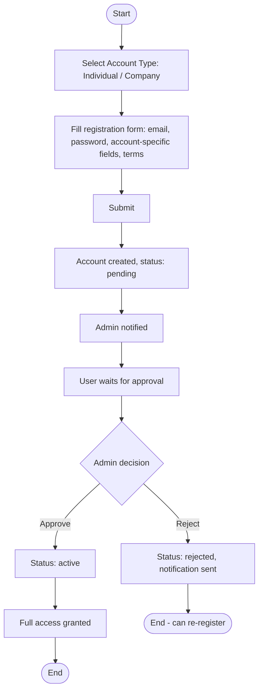
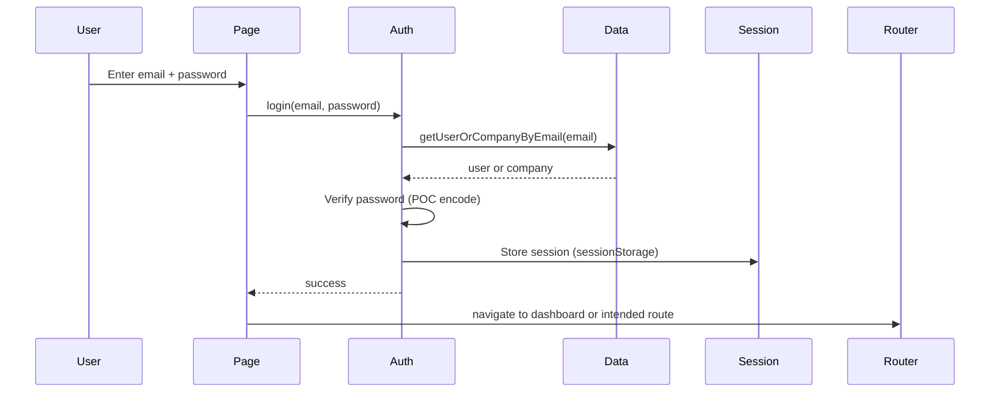

# User Workflow

Step-by-step flows for individual users (professionals and consultants): registration, login, profile, and discovery.

---

## 1. Registration Flow

**Steps (implemented):**

1. User opens **Register** (`/register`).
2. Chooses account type (individual or company); form fields depend on type.
3. Submits: `auth-service.register()` (or company equivalent) → `data-service.createUser()` / company creation.
4. Account stored with `status: 'pending'`.
5. Admin sees user in **Admin → Users** or **Vetting**; can approve or reject.
6. On approve: `data-service.updateUser(id, { status: 'active' })`; notification (e.g. `account_approved`) created.
7. On reject: status `rejected`; notification `account_rejected`.

**Inputs:** Email, password, profile fields (name, specializations, etc.).  
**Outputs:** User record; optional notification to admin; later, notification to user on approve/reject.

**Edge cases:**

- Duplicate email: handled in register flow (e.g. getUserByEmail check).
- Clarification requested: status `clarification_requested`; user may need to resubmit (flow partially specified in BRD).

---

## 2. Login Flow

**Steps:**

1. User opens **Login** (`/login`), enters email and password.
2. `auth-service.login(email, password)` → `getUserOrCompanyByEmail(email)` (checks both users and companies).
3. Password verified (POC: encode comparison; no real hash).
4. Session stored in sessionStorage (token, userId, expiry).
5. Redirect to dashboard or previously requested route (auth-guard).

**Inputs:** Email, password.  
**Outputs:** Session; redirect.

**Edge cases:**

- Invalid credentials: show error; no session.
- Pending/rejected/suspended: login may succeed in POC; admin/vetting flow controls status; production may block login for non-active.

---

## 3. Profile View & Edit

**Steps:**

1. User opens **Profile** (`/profile`) or **Settings** (`/settings`).
2. Page loads current user via `auth-service.getCurrentUser()` (from session) and/or `data-service.getUserById(currentUserId)`.
3. Profile displayed; edit form allows updating name, specializations, certifications, sectors, skills, etc.
4. On save: `data-service.updateUser(id, updates)`.

**Inputs:** Updated profile fields.  
**Outputs:** Updated user record; optionally normalized for matching (e.g. `normalizeUsersForMatching` on init/merge, not necessarily on every save).

**Edge cases:**

- Company vs individual: different profile shapes; UI may show different sections.
- Verification status: display-only unless admin changes it.

---

## 4. Discovery (Find) Flow

**Steps:**

1. User opens **Find** (`/find`).
2. Page loads published opportunities: `data-service.getOpportunities()` filtered by `status === 'published'`.
3. User can filter/search; click opportunity → **Opportunity detail** (`/opportunities/:id`).
4. From detail, user can **Apply** (application workflow) or, if they have a match, see match and go to **Matches**.

**Inputs:** None (or filters).  
**Outputs:** List of opportunities; navigation to detail and application.

---

## 5. Password Reset (Forgot / Reset)

**Forgot password:**

1. User opens **Forgot password** (`/forgot-password`), enters email.
2. System looks up user/company by email; creates reset token (stored in `pmtwin_reset_tokens` or similar).
3. In POC, “send email” is simulated; user is told to check email (or given reset link with token for demo).
4. User opens **Reset password** (`/reset-password?token=...`), enters new password.
5. Token validated; password updated; token invalidated; redirect to login.

**Inputs:** Email (forgot); token + new password (reset).  
**Outputs:** Reset token (forgot); updated password (reset).

---

## State Changes Summary

| Action | Entity | State change |
|--------|--------|--------------|
| Register | User/Company | Created with status `pending` |
| Admin approve | User/Company | status → `active` |
| Admin reject | User/Company | status → `rejected` |
| Login | Session | Session created in sessionStorage |
| Logout | Session | Session cleared |
| Update profile | User/Company | profile + updatedAt updated |

---

## Related Documentation

- [Actors](actors.md)
- [Opportunity Workflow](opportunity-workflow.md)
- [Matching Workflow](matching-workflow.md)
- [Deal Workflow](deal-workflow.md)
